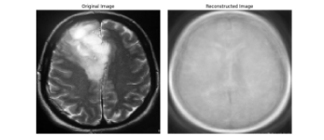
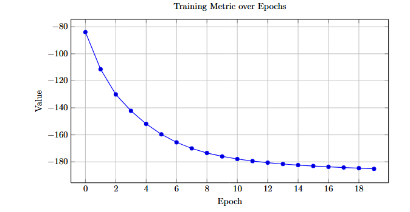
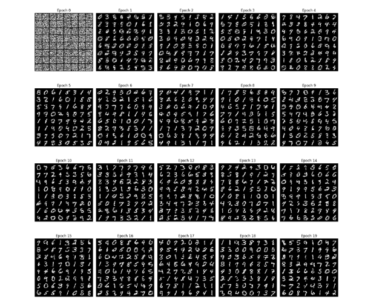
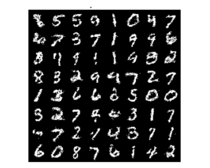

# HW1 — Deep Learning Assignment: PCA and Restricted Boltzmann Machine

## Overview

This homework contains two main parts:

1. **Principal Component Analysis (PCA)** applied to Brain Tumor MRI images.
2. **Restricted Boltzmann Machine (RBM)** trained on the MNIST handwritten digit dataset.

The PCA part studies dimensionality reduction, image reconstruction, and the effect of reducing image features on classification accuracy.  
The RBM part studies energy-based generative modeling and uses Contrastive Divergence to train a model that can generate digit-like MNIST samples.

---

# Part 1 — PCA for Brain Tumor MRI Images

## Goal

The goal of this part is to implement PCA from scratch and apply it to a Brain Tumor MRI dataset. The dataset contains two classes:

| Folder | Label | Meaning |
|---|---:|---|
| `yes` | 1 | Tumor |
| `no` | 0 | Healthy |

The main tasks are:

1. Preprocess the MRI images.
2. Reduce the image dimension using PCA.
3. Reconstruct images from the reduced PCA representation.
4. Compare SVM classification accuracy before and after PCA.

## Dataset and Preprocessing

Each image is processed before PCA:

1. The brain region is cropped using contour-based image processing.
2. The image is converted to grayscale.
3. The image is resized to $128 \times 128$ pixels.
4. The image is flattened into a vector of length $16384$.

The final dataset details are:

| Quantity | Value |
|---|---:|
| Number of images | 253 |
| Image size | $128 \times 128$ |
| Flattened feature size | 16384 |
| Training samples | 202 |
| Test samples | 51 |
| PCA components | 20 |

## PCA Implementation

PCA was implemented manually using NumPy. The steps are:

1. Compute the mean of the training data.
2. Center the training data by subtracting the mean.
3. Compute the covariance matrix.
4. Compute eigenvalues and eigenvectors.
5. Sort eigenvectors according to descending eigenvalues.
6. Select the top 20 principal components.
7. Project the training and test data into the reduced PCA space.

The original feature dimension was reduced as:

$$
16384 \rightarrow 20.
$$

PCA was fitted only on the training data. Then the same PCA components were used to transform both the training and test sets. This avoids test-data leakage.

## Image Reconstruction

After reducing an image to 20 PCA components, the image was reconstructed back to the original pixel space using

$$
x_{\text{recon}} = x_{\text{reduced}}U^\top + \mu,
$$

where $U$ is the matrix of selected principal components and $\mu$ is the training-set mean image.

The reconstructed image keeps the general structure of the brain, but many fine details are lost because the dimensionality reduction is very aggressive.

## PCA Classification Results

A linear SVM classifier was tested before and after applying PCA.

| Experiment | Feature Dimension | Test Accuracy |
|---|---:|---:|
| SVM before PCA | 16384 | 74.51% |
| SVM after PCA | 20 | 62.75% |

The accuracy decreased after PCA. This shows that reducing the image to only 20 principal components removed some information that was important for distinguishing tumor images from healthy images.

## PCA Figure

### Original and Reconstructed MRI Image

  

**Figure 1.** Original MRI image on the left and reconstructed image on the right after reducing the image to 20 PCA components. The reconstruction preserves the coarse brain shape but loses fine details.

## PCA Analysis

PCA is an unsupervised dimensionality reduction method. It keeps directions with the highest variance, but it does not use class labels.

In this dataset, some tumor-related features may not correspond to the highest-variance directions. Therefore, PCA successfully reduced the feature dimension, but it also discarded discriminative information needed by the classifier.

This explains why the SVM accuracy decreased from 74.51% to 62.75%.

## PCA Takeaways

| Concept | Main Takeaway |
|---|---|
| PCA | Reduces dimensionality by keeping high-variance directions |
| Train-test leakage | PCA should be fitted only on training data |
| Reconstruction | PCA preserves coarse structure but loses fine details |
| Classification | Accuracy decreased after reducing to 20 components |
| Limitation | PCA is unsupervised and may discard class-relevant features |
| Medical images | Small visual details can be important for classification |

---

# Part 2 — Restricted Boltzmann Machine on MNIST

## Goal

The goal of this part is to implement and train a Restricted Boltzmann Machine on the MNIST dataset.

An RBM is an energy-based generative model with two layers:

1. A **visible layer**, representing the input image pixels.
2. A **hidden layer**, representing latent features learned from data.

The model is trained to learn the distribution of MNIST digits and generate new digit-like samples.

## RBM Theory

An RBM defines an energy function for a visible vector $v$ and hidden vector $h$:

$$
E(v,h) = -a^\top v - b^\top h - v^\top Wh,
$$

where:

- $a$ is the visible bias,
- $b$ is the hidden bias,
- $W$ is the weight matrix between visible and hidden units.

The joint probability is

$$
p(v,h) = \frac{1}{Z}\exp(-E(v,h)),
$$

where $Z$ is the partition function.

The free energy of a visible vector is

$$
F(v) = -a^\top v - \sum_j \log(1+\exp(W_j^\top v + b_j)).
$$

The training loss is based on the free-energy difference between the real input and the reconstructed sample:

$$
\text{Loss} = \mathbb{E}[F(v)] - \mathbb{E}[F(v')],
$$

where $v'$ is the reconstructed visible sample after Gibbs sampling.

## RBM Implementation

The RBM was implemented using PyTorch.

| Component | Value |
|---|---:|
| Dataset | MNIST |
| Image size | $28 \times 28$ |
| Visible units | 784 |
| Hidden units | 128 |
| Gibbs steps during training | $k = 1$ |
| Batch size | 64 |
| Optimizer | Adam |
| Learning rate | 0.0001 |
| Gradient clipping | Max norm = 1.0 |
| Training epochs | 20 |

MNIST images were binarized using `torch.bernoulli`, because the RBM uses binary visible units.

## Visible-to-Hidden Sampling

The probability of hidden units being active is computed as

$$
p(h|v) = \sigma(W^\top v + b),
$$

where $\sigma$ is the sigmoid function.

## Hidden-to-Visible Reconstruction

The reconstructed visible vector is computed as

$$
p(v|h) = \sigma(Wh + a).
$$

This step allows the RBM to reconstruct or generate images from hidden features.

## Contrastive Divergence

The RBM was trained using Contrastive Divergence with one Gibbs sampling step.

The process is:

1. Start from a real MNIST image.
2. Sample the hidden units.
3. Reconstruct the visible units.
4. Compare the free energy of the real image and reconstructed image.
5. Update the model parameters.

Using $k=1$ makes training efficient, but it can also limit the quality of generated samples.

## RBM Key Results

The training metric decreased steadily over 20 epochs, showing that the RBM learned meaningful structure from MNIST.

The final reported training metric was approximately:

$$
-185.1377.
$$

At epoch 0, the generated samples look mostly like random noise. As training progresses, the samples become more digit-like. After 20 epochs, the RBM can generate recognizable handwritten-digit patterns, although some samples are still noisy.

## RBM Figures

### Training Metric over Epochs

  

**Figure 2.** Training metric over 20 epochs. The decreasing curve shows that the model is learning to reduce the free-energy difference during training.

### Generation Progress over Epochs

  

**Figure 3.** Generated MNIST samples from epoch 0 to epoch 19. The samples start as noise and gradually become more digit-like.

### Final Generated Samples

  

**Figure 4.** Final generated samples after training. The RBM produces digit-like images using Gibbs sampling, although the outputs are not perfectly sharp.

## RBM Analysis

The RBM successfully learns basic digit-like structures from MNIST. The decreasing training metric confirms that the optimization process is working.

However, the generated samples are still somewhat noisy. This is expected because the model is simple and uses only one Gibbs sampling step during training.

Binarizing MNIST makes the dataset suitable for binary visible units, but it also removes grayscale information. This may reduce the sharpness of generated images.

Longer Gibbs sampling, more hidden units, or Persistent Contrastive Divergence could improve the quality of the generated samples.

## RBM Takeaways

| Concept | Main Takeaway |
|---|---|
| RBM | A generative energy-based model with visible and hidden units |
| Energy function | Assigns lower energy to more likely configurations |
| Free energy | Used to compare real and reconstructed samples |
| Contrastive Divergence | Efficient approximate training method for RBMs |
| MNIST generation | The trained RBM can generate digit-like samples |
| Limitation | Samples remain noisy because the model is simple |

---

# Overall Results Summary

| Part | Main Method | Dataset | Main Result |
|---|---|---|---|
| PCA | Dimensionality reduction from scratch | Brain Tumor MRI | Reduced 16384 features to 20, but SVM accuracy dropped from 74.51% to 62.75% |
| RBM | Energy-based generative modeling | MNIST | Training metric reached about -185.1377 and generated digit-like samples |

---

# Possible Improvements

| Part | Improvement | Reason |
|---|---|---|
| PCA | Try more PCA components | 20 components may be too few for MRI classification |
| PCA | Use cross-validation | Helps choose the best number of components |
| PCA | Try supervised dimensionality reduction | Methods like LDA use label information |
| PCA | Use CNN features | CNNs are more suitable for image classification |
| RBM | Increase Gibbs steps $k$ | Gives a better approximation of the model distribution |
| RBM | Use Persistent Contrastive Divergence | Can improve sampling stability |
| RBM | Increase hidden units | Allows learning more complex digit features |
| RBM | Train longer | May improve generated sample quality |

---

# Conclusion

This homework explored two important deep learning and machine learning concepts.

In the PCA part, dimensionality reduction was implemented from scratch and applied to Brain Tumor MRI images. PCA successfully compressed the images from 16384 features to 20 features, but the SVM accuracy decreased because important classification details were lost.

In the RBM part, an energy-based generative model was implemented and trained on MNIST. The training metric decreased steadily, and the model learned to generate digit-like samples. The generated images were not perfect, but they showed that the RBM learned meaningful patterns from the data.

Overall, this assignment demonstrates both the usefulness and limitations of representation learning methods. PCA is useful for compression and visualization, while RBMs provide a foundation for understanding energy-based generative models.