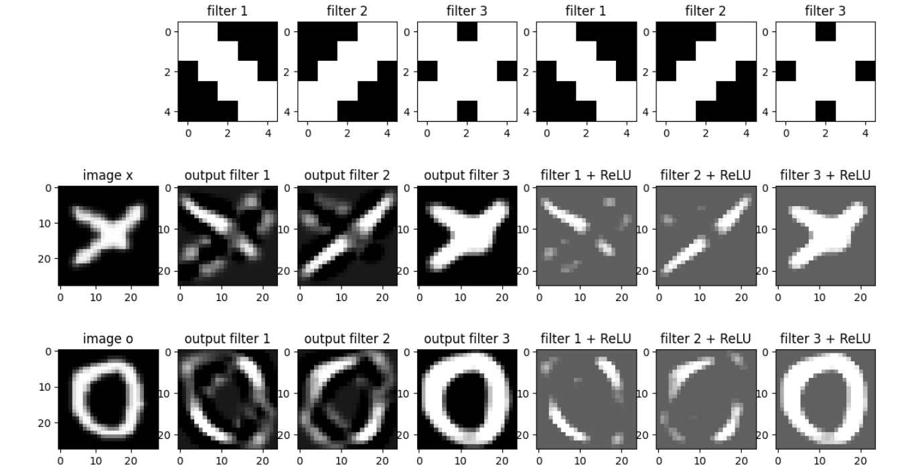
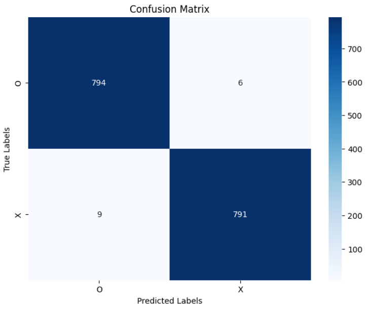
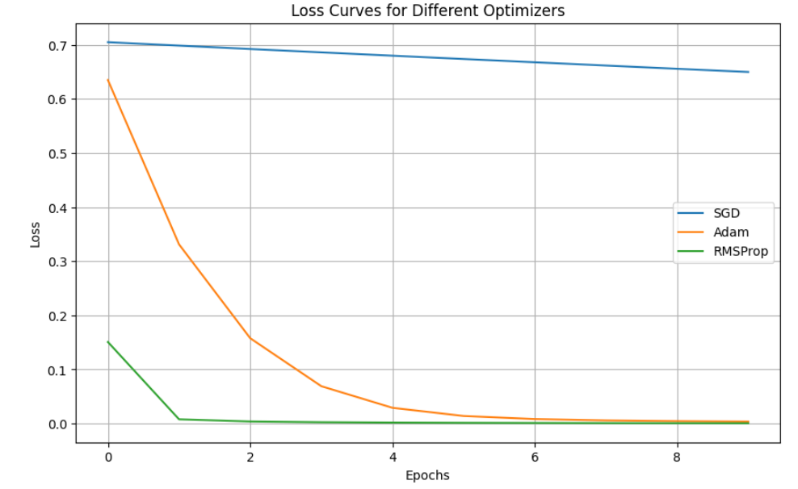

# HW2 — Convolutional Neural Networks on EMNIST and FashionMNIST

## Overview

This homework studies Convolutional Neural Networks (CNNs) for image classification. The assignment contains two main parts:

1. **EMNIST binary classification**: handwritten `O` versus `X`.
2. **FashionMNIST binary classification**: `T-shirt/top` versus `Shirt`.

The main goal is to understand how convolutional filters extract visual features, how ReLU strengthens useful activations, how CNNs compare with fully connected networks, and how training choices such as optimizers, activation functions, dropout, batch normalization, data augmentation, and early stopping affect performance.

---

# Part 1 — EMNIST O/X Classification

## Dataset

The EMNIST dataset was filtered to keep only two handwritten character classes:

| Class | Label |
|---|---:|
| O | 0 |
| X | 1 |

The dataset used in this assignment contains:

| Split | Number of Images |
|---|---:|
| Training set | 9600 |
| Test set | 1600 |

Each image is grayscale and has size:

$$
28 \times 28.
$$

The images are passed to the CNN as single-channel tensors with shape:

$$
1 \times 28 \times 28.
$$

---

## CNN Theory

A Convolutional Neural Network is designed for data with spatial structure, especially images. Instead of connecting every pixel to every neuron, CNNs use small filters that slide over the image and detect local patterns.

The convolution operation can be written as:

$$
(I * K)(x,y) = \sum_m \sum_n I(x+m,y+n)K(m,n),
$$

where:

- $I$ is the input image,
- $K$ is the convolution kernel/filter,
- $(I*K)$ is the output feature map.

CNNs are effective because early layers can detect simple patterns such as edges and strokes, while deeper layers combine them into more complex shapes.

A typical CNN contains:

| Component | Purpose |
|---|---|
| Convolutional layers | Extract local visual features |
| Activation functions | Add non-linearity |
| Pooling layers | Reduce spatial size and computation |
| Fully connected layers | Perform final classification |
| Batch normalization | Stabilize and speed up training |
| Dropout | Reduce overfitting |

---

## Advantages and Disadvantages of CNNs

<div align="center">

| Aspect | Explanation |
|---|---|
| Spatial hierarchy | CNNs preserve local image structure and learn features from simple to complex |
| Parameter efficiency | Weight sharing reduces the number of parameters compared to fully connected networks |
| Translation robustness | Pooling makes the model less sensitive to small shifts in the image |
| Strong image performance | CNNs are very effective for image classification tasks |
| Computational cost | Deep CNNs can require significant training time and GPU resources |
| Overfitting risk | Deep models may overfit without regularization |
| Limited global context | CNNs mainly focus on local patterns unless the network is deep enough |

</div>

---

## Manual Filter Visualization

Before training the CNN, handcrafted convolution filters were applied to sample `X` and `O` images.

The filters were designed to respond to simple visual structures such as diagonal strokes and circular patterns. This helps explain why convolution is useful for image recognition: a complex image can be understood through simpler local features.

A negative bias was added to make the filters more selective. Without a negative bias, weak partial matches could produce positive activations. The negative bias raises the activation threshold, so the filter responds strongly only when the pattern is clearly present.

After applying ReLU, negative responses are removed and only strong positive activations remain.

### Filter and ReLU Visualization

<p align="center">
  
</p>

**Figure 1.** Three handcrafted filters applied to sample `X` and `O` images. The raw filter outputs show directional and shape-based responses, while the ReLU outputs keep only positive activations.

---

## Why ReLU Helps

ReLU is defined as:

$$
\text{ReLU}(x) = \max(0,x).
$$

After convolution, feature maps can contain both positive and negative values. Positive values usually indicate that the filter matched a local pattern in the image. Negative values usually correspond to weak matches or irrelevant regions.

ReLU helps by:

1. Keeping strong positive activations.
2. Suppressing negative responses.
3. Introducing non-linearity.
4. Making the network more selective.
5. Helping deeper layers combine useful features.

For the `O` versus `X` problem, ReLU helps the network focus on meaningful strokes and curves.

---

## EMNIST CNN Architecture

The main CNN model for EMNIST classification is:

| Layer | Description |
|---|---|
| Conv1 | 1 input channel, 32 output channels, 3×3 kernel |
| Activation | ReLU |
| Conv2 | 32 input channels, 64 output channels, 3×3 kernel |
| Activation | ReLU |
| MaxPool | 2×2 pooling, stride 2 |
| Flatten | Converts feature maps to a vector |
| FC1 | 64×12×12 to 128 |
| Activation | ReLU |
| FC2 | 128 to 2 output classes |

The model has:

$$
1,198,850
$$

trainable parameters.

The forward pass is:

```python
def forward(self, x):
    x = F.relu(self.conv1(x))
    x = self.pool(F.relu(self.conv2(x)))
    x = torch.flatten(x, 1)
    x = F.relu(self.fc1(x))
    x = self.fc2(x)
    return x
```

---

## EMNIST CNN Result

The CNN achieved:

$$
99.0625\%
$$

test accuracy on the EMNIST `O` versus `X` classification task.

This means the model correctly classified:

$$
1585
$$

out of 1600 test images.

---

## Confusion Matrix

The confusion matrix was:

| True Label | Predicted O | Predicted X |
|---|---:|---:|
| O | 794 | 6 |
| X | 9 | 791 |

The model made only:

$$
6 + 9 = 15
$$

mistakes on the test set.

### EMNIST Confusion Matrix

<p align="center">
  
</p>

**Figure 2.** Confusion matrix for the EMNIST `O` versus `X` classifier. The model correctly classifies most samples from both classes.

---

## Classification Metrics

The classification report showed very strong performance for both classes:

| Class | Precision | Recall | F1-score | Support |
|---|---:|---:|---:|---:|
| O | 0.99 | 0.99 | 0.99 | 800 |
| X | 0.99 | 0.99 | 0.99 | 800 |
| Accuracy |  |  | 0.99 | 1600 |

Both classes were classified with almost equal performance, which means the model was not biased toward one class.

---

## Example Prediction Confidence

For a sample `X` image, the trained CNN predicted:

| Class | Confidence |
|---|---:|
| O | 0.0015 |
| X | 0.9985 |

For a sample `O` image, the trained CNN predicted:

| Class | Confidence |
|---|---:|
| O | 0.9998 |
| X | 0.0002 |

These examples show that the model is highly confident on clear samples from both classes.

---

## CNN versus Fully Connected Network

A fully connected neural network was also trained on the same EMNIST task.

The MLP architecture was:

| Layer | Description |
|---|---|
| FC1 | 784 to 128 |
| FC2 | 128 to 64 |
| FC3 | 64 to 2 |

The MLP had:

$$
108,866
$$

trainable parameters.

The result was:

| Model | Parameters | Test Accuracy | Training Time |
|---|---:|---:|---:|
| CNN | 1,198,850 | 99.0625% | Noted from CNN training loop |
| MLP | 108,866 | 99.31% | 217.24 seconds |

Although the MLP slightly exceeded the CNN accuracy in this particular run, CNNs are generally more suitable for image data because they preserve spatial structure and learn local visual features. The EMNIST `O` versus `X` task is relatively simple, so even a fully connected network can perform very well.

---

## Optimizer Comparison on EMNIST

Three optimizers were compared using the EMNIST CNN:

| Optimizer | Learning Rate | Behavior |
|---|---:|---|
| SGD | $10^{-4}$ | Slow convergence |
| Adam | $10^{-5}$ | Fast and stable convergence |
| RMSProp | $10^{-5}$ | Fastest convergence in this experiment |

The recorded average losses were:

| Optimizer | Initial Loss | Final Loss |
|---|---:|---:|
| SGD | 0.7048 | 0.6497 |
| Adam | 0.6349 | 0.0037 |
| RMSProp | 0.1508 | 0.0007 |

### Optimizer Loss Curves

<p align="center">
  
</p>

**Figure 3.** Loss curves for SGD, Adam, and RMSProp. Adam and RMSProp converge much faster than SGD.

The result shows that adaptive optimizers are much more efficient in this setup. SGD decreased slowly and would likely need a larger learning rate, momentum, or learning-rate scheduling to converge faster.

---

## Activation Function Comparison

The same CNN architecture was tested with different activation functions:

| Activation | Explanation |
|---|---|
| ReLU | Simple, fast, and effective for deep networks |
| Tanh | Zero-centered but can saturate and train more slowly |
| LeakyReLU | Allows a small negative gradient and helps avoid dying ReLU |

The displayed final training-batch losses after 5 epochs were approximately:

| Activation | Final Displayed Loss |
|---|---:|
| ReLU | 0.00592 |
| Tanh | 0.00632 |
| LeakyReLU | 0.00462 |

LeakyReLU had the lowest displayed loss among the three activation functions. This is consistent with the idea that allowing a small gradient for negative values can help optimization.

---

## Deeper CNN Experiment

A deeper EMNIST model was also tested with four convolutional layers.

The architecture was:

| Layer | Description |
|---|---|
| Conv1 | 1 to 32 channels |
| Conv2 | 32 to 64 channels |
| Conv3 | 64 to 128 channels |
| Conv4 | 128 to 256 channels |
| MaxPool | Applied after Conv2, Conv3, and Conv4 |
| FC1 | 256 to 512 |
| Dropout | $p = 0.5$ |
| FC2 | 512 to 128 |
| FC3 | 128 to 2 |

The dummy-data training output was:

| Epoch | Loss | Accuracy |
|---:|---:|---:|
| 1 | 0.7026 | 15.00% |
| 10 | 0.6299 | 100.00% |

The 100% accuracy is not a reliable generalization result because this experiment was run on a very small dummy dataset. It mainly shows that the deeper architecture and training loop work correctly.

A deeper CNN can learn richer features, but it can also overfit if the dataset is small or if regularization is not strong enough.

---

# Part 2 — FashionMNIST Binary Classification

## Dataset

FashionMNIST contains grayscale images of clothing items. In this homework, the dataset was reduced to two classes:

| Class | New Label |
|---|---:|
| T-shirt/top | 0 |
| Shirt | 1 |

The dataset split was:

| Split | Number of Images |
|---|---:|
| Training set | 9600 |
| Validation set | 2400 |
| Test set | 2000 |

Each image has size:

$$
28 \times 28.
$$

---

## Baseline FashionMNIST CNN

The baseline FashionMNIST CNN used two convolutional layers and two fully connected layers.

| Layer | Description |
|---|---|
| Conv1 | 1 to 32 channels, 3×3 kernel |
| Conv2 | 32 to 64 channels, 3×3 kernel |
| MaxPool | 2×2 pooling |
| FC1 | 9216 to 128 |
| FC2 | 128 to 2 classes |

The baseline model was trained for 20 epochs.

The final results were:

| Metric | Value |
|---|---:|
| Test accuracy | 0.8920 |
| Final train loss | 0.0182 |
| Final train accuracy | 0.9950 |
| Final validation loss | 0.4221 |
| Final validation accuracy | 0.8933 |

The large gap between training accuracy and validation accuracy shows signs of overfitting. The model fits the training data very strongly, but it does not generalize equally well to validation and test data.

---

## Overfitting Discussion

The baseline FashionMNIST model shows overfitting because:

- Training accuracy is very high.
- Training loss is very low.
- Validation accuracy is lower than training accuracy.
- Validation loss is much higher than training loss.

Possible solutions include:

| Method | Purpose |
|---|---|
| Dropout | Randomly disables neurons during training |
| Weight decay | Penalizes large weights |
| Data augmentation | Increases training variation |
| Early stopping | Stops training before overfitting becomes worse |
| Simpler architecture | Reduces model capacity |
| Hyperparameter tuning | Improves optimization and generalization |

---

## Dropout Regularization

Dropout was added to reduce overfitting.

The dropout model achieved:

| Model | Test Accuracy |
|---|---:|
| Dropout CNN | 0.8915 |

Another regularized run achieved:

| Model | Test Accuracy |
|---|---:|
| Regularized CNN | 0.8865 |

Dropout reduces reliance on specific neurons and encourages the model to learn more robust features.

---

## Why Validation Accuracy Can Start Higher Than Training Accuracy

Validation accuracy can start higher than training accuracy because dropout and other training-time effects make the training task harder. During training, dropout randomly disables neurons, so the model sees a noisier version of itself. During validation, dropout is disabled, so the full model is used.

This can make validation accuracy appear higher than training accuracy in the early epochs.

---

## Data Augmentation

Data augmentation was used to increase the diversity of the training data.

The applied augmentations included methods such as:

| Augmentation | Purpose |
|---|---|
| Random rotation | Makes the model robust to small rotations |
| Random horizontal flip | Adds variation to clothing orientation |
| Random crop | Simulates small translations |
| Color jitter | Changes brightness/contrast |
| Gaussian blur | Simulates blurred images |

With standard augmentation, the model achieved:

| Experiment | Test Accuracy |
|---|---:|
| Dropout + standard augmentation | 0.8810 |

A stronger augmentation experiment achieved:

| Experiment | Test Accuracy |
|---|---:|
| Stronger augmentation | 0.8310 |

This shows that augmentation must be chosen carefully. Moderate augmentation can improve generalization, but overly strong augmentation may distort the images too much and hurt performance.

---

## Batch Normalization Experiment

Batch normalization was tested as another method for improving training stability.

The batch-normalized architecture used normalization after convolutional and fully connected layers.

| Layer | Normalization |
|---|---|
| Conv1 | BatchNorm2d |
| Conv2 | BatchNorm2d |
| FC1 | BatchNorm1d |

The comparison was:

| Model | Test Accuracy | Final Train Accuracy | Final Validation Accuracy | Overfitting Gap |
|---|---:|---:|---:|---:|
| Dropout CNN | 0.8810 | 0.8951 | 0.8825 | 0.0126 |
| BatchNorm CNN | 0.8755 | 0.9534 | 0.8679 | 0.0855 |

In this run, the dropout model generalized better than the batch-normalized model. The BatchNorm model reached higher training accuracy, but it had a larger gap between training and validation accuracy.

---

## BatchNorm and Dropout Order

When using both BatchNorm and Dropout, the preferred order is usually:

$$
\text{Convolution} \rightarrow \text{BatchNorm} \rightarrow \text{Activation} \rightarrow \text{Dropout}.
$$

BatchNorm should generally come before Dropout because BatchNorm estimates activation statistics. If Dropout is applied first, it randomly changes these statistics and can make normalization less stable.

---

## Early Stopping

Early stopping was implemented by monitoring validation loss. Training stops if validation loss does not improve for 3 epochs.

The results were:

| Model | Early Stopping Epoch | Test Accuracy |
|---|---:|---:|
| Dropout CNN | 16 | 0.8635 |
| BatchNorm CNN | 7 | 0.8455 |

The final comparison was:

| Model | Final Train Accuracy | Final Validation Accuracy | Overfitting Gap |
|---|---:|---:|---:|
| Dropout CNN | 0.8781 | 0.8717 | 0.0065 |
| BatchNorm CNN | 0.9066 | 0.8346 | 0.0720 |

Early stopping helps prevent overfitting by stopping training when validation loss stops improving. It also saves computation by avoiding unnecessary epochs.

In this run, early stopping reduced the overfitting gap, but the final test accuracy was lower than some of the longer training runs.

---

## FashionMNIST Optimizer Comparison

The batch-normalized FashionMNIST model was trained with three optimizers:

| Optimizer | Settings | Test Accuracy |
|---|---|---:|
| SGD | lr = 0.01, momentum = 0.9 | 0.8995 |
| Adam | lr = 0.001 | 0.8900 |
| RMSProp | lr = 0.001 | 0.8955 |

In this experiment, SGD with momentum achieved the best final test accuracy. Adam and RMSProp were still stable and effective, but SGD reached the highest test accuracy in this particular run.

---

# Overall Results Summary

<div align="center">

| Part | Experiment | Main Result |
|---|---|---|
| EMNIST | CNN for O/X classification | 99.0625% test accuracy |
| EMNIST | Confusion matrix | 1585 correct out of 1600 |
| EMNIST | MLP comparison | MLP reached 99.31% with 108,866 parameters |
| EMNIST | Optimizer comparison | RMSProp and Adam converged much faster than SGD |
| EMNIST | Activation comparison | LeakyReLU had the lowest displayed final loss |
| EMNIST | Deeper CNN | Worked on dummy data, but result is not a reliable generalization test |
| FashionMNIST | Baseline CNN | 0.8920 test accuracy |
| FashionMNIST | Dropout CNN | 0.8915 test accuracy |
| FashionMNIST | Standard augmentation | 0.8810 test accuracy |
| FashionMNIST | Stronger augmentation | 0.8310 test accuracy |
| FashionMNIST | BatchNorm CNN | 0.8755 test accuracy |
| FashionMNIST | Early stopping with dropout | 0.8635 test accuracy |
| FashionMNIST | Optimizer comparison | SGD with momentum reached 0.8995 test accuracy |

</div>

---

# Key Takeaways

<div align="center">

| Concept | Main Takeaway |
|---|---|
| Convolution | Extracts local spatial features from images |
| Manual filters | Help visualize how CNNs detect strokes and shapes |
| Negative bias | Makes filters more selective |
| ReLU | Keeps strong positive activations and suppresses irrelevant negative responses |
| CNNs | Perform very well on image classification tasks |
| MLP comparison | Fully connected models can work on simple tasks but do not explicitly preserve image structure |
| Optimizers | Adam and RMSProp converge faster; SGD can work well with momentum |
| Dropout | Helps reduce overfitting by randomly disabling neurons |
| BatchNorm | Stabilizes training but does not always improve generalization alone |
| Data augmentation | Helps when moderate, but overly strong augmentation can reduce accuracy |
| Early stopping | Can reduce overfitting and save computation |
| Deeper networks | Can learn richer features but need enough data and regularization |

</div>

---

# Figure Files

The figures used in this README should be saved in the `figures` folder with these names:

| Figure | File Name |
|---|---|
| CNN filter and ReLU visualization | `figures/cnn_filter_relu_visualization.png` |
| EMNIST confusion matrix | `figures/emnist_confusion_matrix.png` |
| EMNIST optimizer loss curves | `figures/emnist_optimizer_loss_curves.png` |

---

# Conclusion

This homework implemented and analyzed CNN-based image classifiers on EMNIST and FashionMNIST.

In the EMNIST part, the CNN achieved very high accuracy for the binary `O` versus `X` classification task, with only 15 mistakes out of 1600 test images. The filter visualizations showed how convolutional kernels respond to different stroke patterns, and the ReLU outputs demonstrated how CNNs keep strong positive feature responses.

The optimizer comparison showed that Adam and RMSProp converged much faster than plain SGD. The activation comparison showed that LeakyReLU produced the lowest displayed final loss among the tested activation functions.

In the FashionMNIST part, the baseline model showed signs of overfitting. Dropout, batch normalization, data augmentation, early stopping, and optimizer changes were tested as ways to improve generalization. The best FashionMNIST result in the reported experiments came from SGD with momentum, reaching 0.8995 test accuracy.

Overall, this assignment demonstrates how CNNs learn useful image features and how design choices such as activation functions, optimizers, depth, normalization, dropout, augmentation, and early stopping affect model performance.