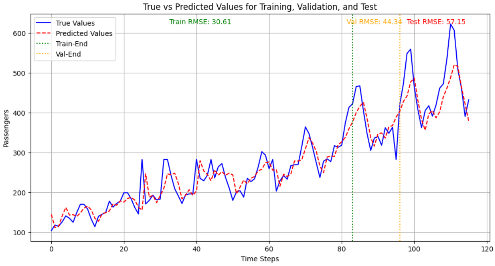
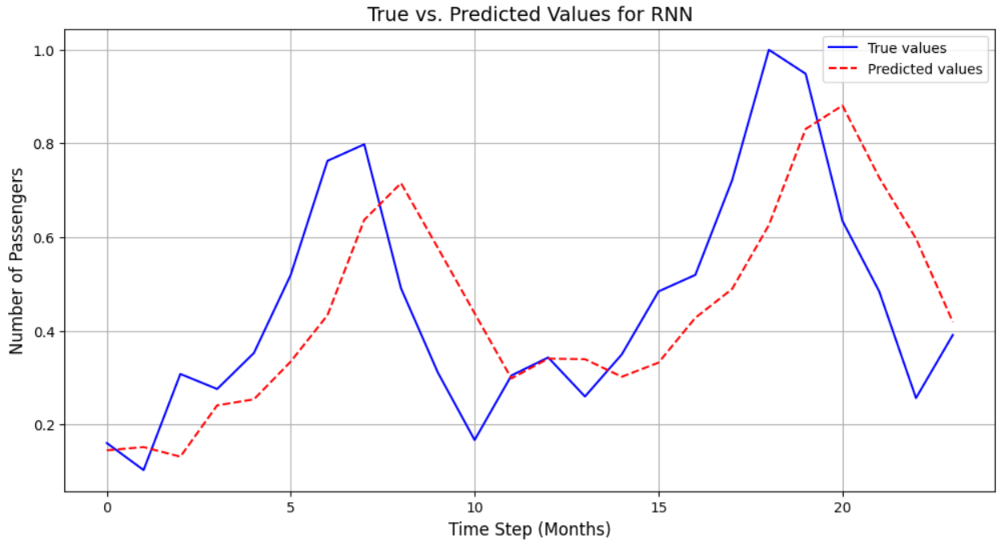
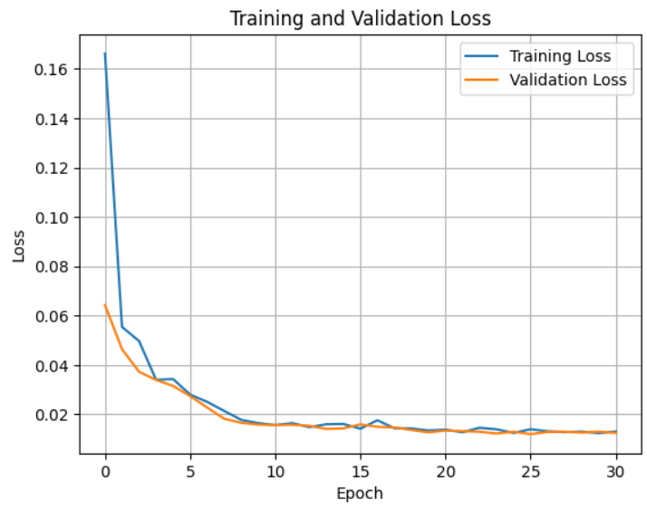
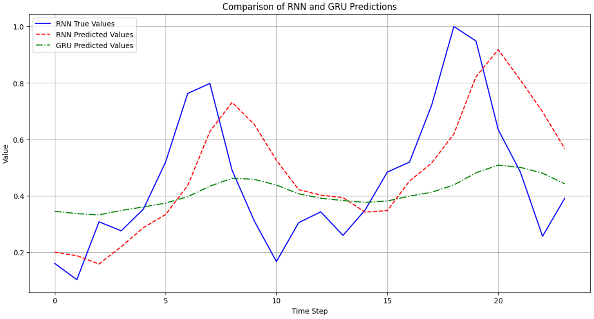
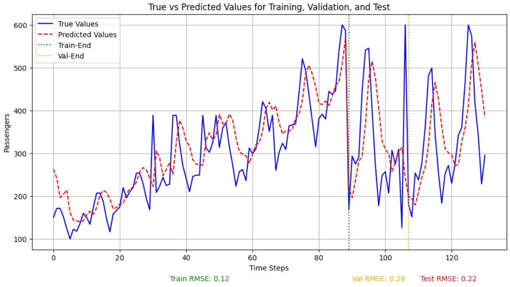

# HW3 — Time Series Forecasting with RNNs and GRUs

## Overview

This homework studies time series forecasting using recurrent neural networks. The main task is to predict monthly airline passenger counts using:

1. **Recurrent Neural Network (RNN)**
2. **Gated Recurrent Unit (GRU)**

The dataset contains monthly airline passenger counts from 1949 to 1960. Since the data is sequential, the order of the observations is important, so recurrent models are suitable for this task.

The homework focuses on:

- cleaning and preprocessing a time series dataset,
- handling missing values and duplicate rows,
- creating sliding-window input sequences,
- training RNN and GRU models,
- evaluating the models using RMSE,
- comparing true and predicted passenger counts.

---

# Dataset

The dataset contains monthly airline passenger counts.

| Column | Description |
|---|---|
| `Month` | Month in `YYYY-MM` format |
| `Passengers` | Number of passengers |

The raw dataset had:

| Property | Value |
|---|---:|
| Raw number of rows | 174 |
| Number of columns | 2 |
| Duplicate rows | 28 |
| Missing passenger values | 8 |
| Mean passenger count | 280.65 |
| Standard deviation | 114.89 |
| Minimum passenger count | 104 |
| Maximum passenger count | 622 |

The dataset has a clear upward trend and seasonal behavior, which makes it appropriate for time series forecasting.

---

# Preprocessing

The preprocessing steps were:

1. Inspect the dataset and summary statistics.
2. Remove duplicate rows.
3. Handle missing passenger values.
4. Split the data into training, validation, and test sets.
5. Normalize the passenger counts to the range $[0,1]$ using `MinMaxScaler`.
6. Create sliding-window sequences for supervised learning.

After cleaning, the data was split chronologically as:

| Split | Shape |
|---|---:|
| Training data | 94 |
| Validation data | 23 |
| Test data | 29 |

A sliding window of length 5 was used. This means the model uses the previous 5 passenger values to predict the next value.

After applying sliding windows:

| Split | Input Shape | Target Shape |
|---|---:|---:|
| Train | `(89, 5, 1)` | `(89, 1)` |
| Validation | `(18, 5, 1)` | `(18, 1)` |
| Test | `(24, 5, 1)` | `(24, 1)` |

---

# Time Series Data Leakage

In time series forecasting, data leakage happens when information from the future is used during training.

For example, randomly shuffling a time series before splitting can leak future values into the training set. This gives an unrealistic evaluation result.

To avoid leakage, the data should be split chronologically:

$$
\text{Train} \rightarrow \text{Validation} \rightarrow \text{Test}
$$

The model should train on earlier time steps and be evaluated on later unseen time steps.

---

# RNN Theory

A Recurrent Neural Network is designed for sequential data. Unlike a feedforward neural network, an RNN keeps a hidden state that is updated at every time step.

The hidden state update is:

$$
h_t = \sigma(W_h h_{t-1} + W_x x_t + b_h),
$$

where:

- $x_t$ is the input at time step $t$,
- $h_t$ is the hidden state at time step $t$,
- $h_{t-1}$ is the hidden state from the previous time step,
- $W_h$ and $W_x$ are weight matrices,
- $b_h$ is the bias,
- $\sigma$ is a nonlinear activation function such as `tanh`.

The output is computed as:

$$
y_t = W_y h_t + b_y.
$$

RNNs are useful because they can use previous information when making predictions. However, standard RNNs can suffer from vanishing or exploding gradients, especially for long sequences.

---

# GRU Theory

A Gated Recurrent Unit is an improved recurrent architecture designed to handle long-term dependencies better than a basic RNN.

A GRU uses two main gates:

| Gate | Purpose |
|---|---|
| Update gate | Controls how much previous information is kept |
| Reset gate | Controls how much previous information is forgotten |

The GRU equations are:

$$
z_t = \sigma(W_z x_t + U_z h_{t-1} + b_z),
$$

$$
r_t = \sigma(W_r x_t + U_r h_{t-1} + b_r),
$$

$$
\tilde{h}_t = \tanh(W_h x_t + U_h(r_t \odot h_{t-1}) + b_h),
$$

$$
h_t = (1-z_t)\odot h_{t-1} + z_t \odot \tilde{h}_t.
$$

GRUs usually perform better than simple RNNs on longer sequences because their gates help preserve useful information and reduce the vanishing-gradient problem.

---

# Model Implementation

## RNN Model

The RNN model receives a sequence of passenger values and predicts the next value.

The model uses:

| Component | Value |
|---|---:|
| Input size | 1 |
| Sequence length | 5 |
| Hidden sizes tested | 32, 64, 128 |
| Learning rates tested | 0.001, 0.005, 0.01 |
| Loss function | Mean Squared Error |
| Optimizer | Adam |
| Maximum epochs | 50 |
| Early stopping patience | 5 |

The best hyperparameters reported for the RNN were:

| Hyperparameter | Value |
|---|---:|
| Hidden size | 64 |
| Learning rate | 0.01 |

The best RNN test RMSE was approximately:

$$
\text{RNN RMSE} \approx 0.19
$$

on the normalized scale.

---

## GRU Model

The GRU model was used for comparison with the RNN.

The GRU model includes:

| Component | Description |
|---|---|
| GRU layer | Processes the input sequence |
| Fully connected layer | Maps the last hidden state to the predicted value |
| Loss function | Mean Squared Error |
| Optimizer | Adam |
| Learning rate | 0.001 |
| Epochs | 20 |

The GRU was expected to model temporal dependencies more smoothly because of its gated structure.

---

# Evaluation Metric

The models were evaluated using Root Mean Squared Error.

$$
RMSE =
\sqrt{
\frac{1}{N}
\sum_{i=1}^{N}
(y_i - \hat{y}_i)^2
}
$$

where:

- $y_i$ is the true passenger value,
- $\hat{y}_i$ is the predicted passenger value,
- $N$ is the number of samples.

Lower RMSE means better prediction accuracy.

---

# Results

## RNN Prediction Performance

The RNN was evaluated on the test set after hyperparameter tuning.

The reported RNN RMSE values were around:

| Model | RMSE |
|---|---:|
| RNN | 0.1872 to 0.1929 |

The difference comes from different evaluation cells/runs in the notebook. Overall, the RNN achieved a normalized RMSE of about 0.19.

---

## RNN and GRU Comparison

The comparison output reported:

| Model | Test RMSE |
|---|---:|
| RNN | 0.1872 |
| GRU | 0.2264 |

Although GRUs are usually expected to perform better on long-term sequence modeling, in this experiment the RNN achieved a lower RMSE. The GRU prediction curve was smoother, but it did not follow the sharp peaks as closely as the RNN.

This may be because the dataset is small and the chosen GRU configuration was not tuned as much as the RNN.

---

## Original-Scale RMSE

One of the final plots shows the prediction error on the original passenger-count scale.

| Split | RMSE |
|---|---:|
| Train | 30.61 |
| Validation | 44.34 |
| Test | 57.15 |

The test RMSE is larger than the training RMSE, which is expected because the test set contains later passenger values with larger seasonal peaks.

---

# Figures

## RNN Train, Validation, and Test Prediction — Normalized RMSE

  

**Figure 1.** True and predicted passenger values across training, validation, and test regions. The vertical dotted lines show the end of the training and validation sections. The displayed RMSE values are on the normalized scale.

---

## RNN True vs Predicted Values on Test Set

  

**Figure 2.** True and predicted values for the RNN model on the test sequence. The RNN captures the general trend, but some peaks and valleys are smoothed.

---

## Training and Validation Loss

  

**Figure 3.** Training and validation loss curves. Both losses decrease rapidly at the beginning and then stabilize, showing that the model learned the main time-series pattern.

---

## RNN and GRU Prediction Comparison

  

**Figure 4.** Comparison of RNN and GRU predictions. The RNN prediction follows the true values more closely in this run, while the GRU prediction is smoother and underestimates some high peaks.

---

## RNN Train, Validation, and Test Prediction — Original Scale

  

**Figure 5.** True and predicted passenger values on the original passenger-count scale. The reported RMSE values are Train RMSE = 30.61, Validation RMSE = 44.34, and Test RMSE = 57.15.

---

# Analysis

The airline passenger dataset has both trend and seasonality. This means that the number of passengers generally increases over time, but also follows repeating seasonal patterns.

The RNN model was able to learn the overall behavior of the sequence. It followed the general trend and captured some of the periodic changes. However, it still struggled with sharp peaks.

The GRU model produced smoother predictions. This is consistent with the idea that gated recurrent models often learn stable temporal representations. However, in this specific run, the GRU underfit some of the large peaks and had a higher RMSE than the RNN.

The original-scale RMSE values show that the prediction error becomes larger on the test set. This is expected because the test set is from the later part of the time series, where passenger counts are higher and seasonal peaks are stronger.

---

# Advantages of RNNs and GRUs

| Model | Advantage |
|---|---|
| RNN | Simple recurrent architecture for sequential data |
| RNN | Can use previous time steps when making predictions |
| GRU | Uses gates to control memory |
| GRU | Helps reduce the vanishing-gradient problem |
| GRU | Usually more stable than a basic RNN on longer sequences |
| Both | Suitable for time series forecasting tasks |

---

# Limitations

| Limitation | Explanation |
|---|---|
| Small dataset | The dataset has only a limited number of monthly observations |
| Missing values | Imputation may affect the true temporal pattern |
| Duplicate rows | Duplicates must be removed to avoid biased training |
| Peak prediction | The models smooth some sharp seasonal peaks |
| RNN gradients | Standard RNNs can suffer from vanishing or exploding gradients |
| Hyperparameter sensitivity | Results depend on hidden size, learning rate, and training length |

---

# Possible Improvements

| Improvement | Reason |
|---|---|
| Fit scaler only on training data | Prevents preprocessing leakage |
| Tune the GRU more carefully | The GRU may improve with better hyperparameters |
| Use longer window sizes | More history may help capture seasonality |
| Add dropout | Can reduce overfitting |
| Try LSTM | LSTMs can model longer dependencies |
| Use seasonal features | Month information can help capture yearly cycles |
| Try Transformers | Attention-based models may capture long-range patterns better |
| Use better imputation | More accurate missing-value handling may improve results |

---

# Key Takeaways

| Concept | Main Takeaway |
|---|---|
| Time series forecasting | Future values are predicted from previous observations |
| Chronological split | Time series data should not be randomly shuffled |
| Sliding window | Converts a sequence into supervised learning samples |
| RNN | Learns temporal dependencies using a hidden state |
| GRU | Adds gates to improve memory and stability |
| RMSE | Measures prediction error for regression tasks |
| Result | RNN performed better than GRU in this particular run |
| Limitation | Both models struggled with sharp passenger-count peaks |

---

# Conclusion

This homework implemented recurrent neural network models for airline passenger forecasting. The dataset was cleaned by removing duplicates, handling missing values, normalizing passenger counts, and creating sliding-window sequences.

The RNN model achieved a normalized RMSE of about 0.19 and followed the general trend of the passenger time series. The GRU model was expected to perform better because of its gated structure, but in this experiment it produced smoother predictions and had a higher RMSE than the RNN.

Overall, this assignment shows how recurrent models can be applied to time series forecasting, while also demonstrating the importance of preprocessing, chronological splitting, hyperparameter tuning, and careful evaluation.
