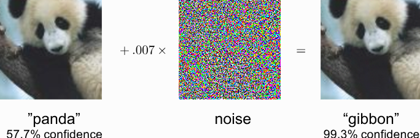
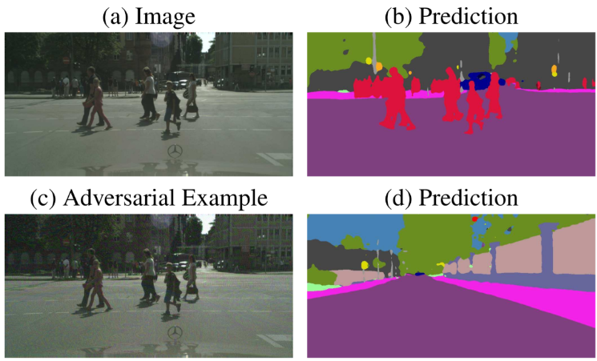

# HW4 — Adversarial Attacks on Deep Neural Networks

## Overview

This homework studies adversarial attacks against deep neural networks. The main idea is that a neural network can make a completely wrong prediction after adding a very small perturbation to the input.

The assignment contains two main parts:

1. **Adversarial attacks on image classification models**
2. **Black-box adversarial attacks on automatic speech recognition models**

The image-classification part focuses on pretrained CNNs on ImageNet, especially ResNet34. The implemented attacks include Fast Gradient Sign Method (FGSM), adversarial patches, and transferability tests across different architectures.

The speech-recognition part studies a black-box adversarial attack against an ASR model, where the attacker does not have access to the model weights or gradients and can only query the system.

---

# Part 1 — Adversarial Attacks on Image Classification

## Motivation

Deep neural networks can achieve high accuracy on clean test data, but they are often not robust to carefully designed perturbations.

A small change to the input image can cause the model to change its prediction completely, even when the image still looks almost identical to a human observer.

For example, a CNN can classify an image correctly as a panda, but after adding a small amount of structured noise, the same image may be classified as a gibbon with very high confidence.

## Example: Panda to Gibbon

  

**Figure 1.** A small adversarial perturbation changes the prediction from `panda` to `gibbon`, even though the image still looks like a panda to a human.

---

## Example: Semantic Segmentation Failure

Adversarial attacks are especially dangerous in safety-critical applications such as autonomous driving. A small perturbation can cause a segmentation model to remove important objects from its prediction.

  

**Figure 2.** An adversarial perturbation changes the semantic segmentation output. Pedestrians that were visible in the original prediction disappear after adding adversarial noise.

---

# Dataset and Model

## ImageNet Subset

The notebook uses a small preprocessed subset of ImageNet.

| Property | Value |
|---|---:|
| Number of classes | 1000 |
| Images per class | 5 |
| Total images | 5000 |
| Task | Image classification |

## Model

The main model used for the experiments is:

| Model | Description |
|---|---|
| ResNet34 | Pretrained CNN from torchvision |
| Dataset | ImageNet |
| Output classes | 1000 |

The model was evaluated on the ImageNet subset before applying attacks.

## Clean Model Performance

On clean images, ResNet34 achieved:

| Metric | Error |
|---|---:|
| Top-1 error | 19.38% |
| Top-5 error | 4.38% |

Top-5 error is important for ImageNet because many images may contain several visually related classes. A prediction is considered correct if the true class appears among the top 5 predicted classes.

---

# White-Box Attacks

White-box attacks assume that the attacker has access to the model parameters and gradients.

This makes it possible to compute the gradient of the loss with respect to the input image and directly modify the image in a direction that increases the model loss.

---

# Fast Gradient Sign Method

## Theory

Fast Gradient Sign Method, or FGSM, is one of the simplest and fastest adversarial attacks.

Given an input image $x$, true label $y$, model parameters $\theta$, and loss function $J(\theta,x,y)$, the adversarial image is computed as:

$$
\tilde{x} = x + \epsilon \cdot \text{sign}(\nabla_x J(\theta,x,y)).
$$

where:

- $x$ is the original image,
- $\tilde{x}$ is the adversarial image,
- $\epsilon$ controls the perturbation strength,
- $\nabla_x J(\theta,x,y)$ is the gradient of the loss with respect to the input image.

The attack changes the input image in the direction that maximizes the loss. This is the opposite of model training, where the model parameters are updated to minimize the loss.

## Implementation

The FGSM attack was implemented by:

1. Passing the input image through the model.
2. Computing the classification loss.
3. Computing the gradient of the loss with respect to the input image.
4. Taking the sign of the gradient.
5. Adding a small perturbation controlled by $\epsilon$.
6. Clipping the final image to keep valid pixel values.

The default perturbation strength used in the notebook was:

$$
\epsilon = 0.02.
$$

This is a very small perturbation, but it is enough to fool the model on many images.

## FGSM Results

After applying FGSM to the ImageNet subset, the model performance degraded strongly.

| Data | Top-1 Error | Top-5 Error |
|---|---:|---:|
| Clean images | 19.38% | 4.38% |
| FGSM adversarial images | 93.74% | 60.82% |

The Top-1 error increased from 19.38% to 93.74%. This means that after the FGSM attack, the model was fooled on almost every image for the top prediction.

The Top-5 error also increased from 4.38% to 60.82%, meaning that for more than half of the attacked images, the true class was not even among the top 5 predictions.

## FGSM Takeaway

FGSM shows that even a single gradient step can create a strong adversarial example. The perturbation is visually small, but the model prediction changes significantly.

---

# Adversarial Patch Attack

## Idea

Instead of changing every pixel slightly, an adversarial patch changes only a small region of the image.

The goal is to create a patch that can be placed on many different images and force the model to predict a chosen target class.

For example, a patch trained for the class `school bus` can make the model predict `school bus` even when the image does not contain a bus.

## Why Patch Attacks Are Important

Adversarial patches are more realistic than full-image noise in some real-world settings.

A printed patch could be physically placed in a scene, and a camera-based model may misclassify the entire image because of that small patch.

This makes adversarial patches especially relevant for:

| Application | Risk |
|---|---|
| Autonomous driving | Misclassification of objects or pedestrians |
| Surveillance systems | Object detection failure |
| Face recognition | Identity misclassification |
| Medical imaging | Incorrect diagnosis support |
| Robotics | Wrong scene understanding |

---

## Patch Training Method

The patch is treated as a learnable parameter.

The model weights are frozen, and only the patch is optimized.

The training procedure is:

1. Choose a target class.
2. Initialize a patch of size $3 \times k \times k$.
3. Place the patch on input images.
4. Pass the patched image through the pretrained model.
5. Compute the loss with respect to the target class.
6. Update only the patch using gradient descent.
7. Repeat until the patch strongly activates the target class.

The patch values are mapped to the valid ImageNet image range before being inserted into the image.

---

# Patch Experiments

Pretrained adversarial patches were tested for five target classes:

| Target Class |
|---|
| toaster |
| goldfish |
| school bus |
| lipstick |
| pineapple |

Each class was tested with three patch sizes:

| Patch Size |
|---|
| $32 \times 32$ |
| $48 \times 48$ |
| $64 \times 64$ |

The smallest patch covers only a small percentage of the image, but it can still fool the model surprisingly often.

---

# Top-1 Fooling Accuracy

Top-1 fooling accuracy measures how often the target class becomes the model's highest-confidence prediction.

| Class name | Patch size 32×32 | Patch size 48×48 | Patch size 64×64 |
|---|---:|---:|---:|
| toaster | 48.89% | 90.48% | 98.58% |
| goldfish | 69.53% | 93.53% | 98.34% |
| school bus | 78.79% | 93.95% | 98.22% |
| lipstick | 43.36% | 86.05% | 96.41% |
| pineapple | 79.74% | 94.48% | 98.72% |

The largest patch size, $64 \times 64$, fooled the model with more than 96% Top-1 accuracy for every tested class.

---

# Top-5 Fooling Accuracy

Top-5 fooling accuracy measures how often the target class appears among the top 5 model predictions.

| Class name | Patch size 32×32 | Patch size 48×48 | Patch size 64×64 |
|---|---:|---:|---:|
| toaster | 72.02% | 98.12% | 99.93% |
| goldfish | 86.31% | 99.07% | 99.95% |
| school bus | 91.64% | 99.15% | 99.89% |
| lipstick | 70.10% | 96.86% | 99.73% |
| pineapple | 92.23% | 99.26% | 99.96% |

The $64 \times 64$ patches reached more than 99.7% Top-5 fooling accuracy for every target class.

This shows that adversarial patches are extremely effective even when they cover only a small part of the input image.

---

# Patch Attack Analysis

The results show a clear trend:

| Observation | Explanation |
|---|---|
| Larger patches fool the model more easily | More pixels can carry adversarial information |
| Some classes are easier to force than others | The model may rely on strong visual shortcuts for those classes |
| Small patches are still effective | CNNs can be highly sensitive to localized patterns |
| Top-5 fooling accuracy is very high | Even when not ranked first, the target class often appears among the strongest predictions |

The easiest target classes in these experiments were `school bus` and `pineapple`.

The harder target classes were `toaster` and `lipstick`, but even these reached strong fooling rates with larger patches.

---

# Transferability of Adversarial Patches

Adversarial examples can sometimes transfer from one model architecture to another.

In the notebook, a patch trained on ResNet34 was tested on DenseNet121.

The tested patch was:

| Patch | Value |
|---|---|
| Target class | pineapple |
| Patch size | $64 \times 64$ |
| Original model | ResNet34 |
| Transfer model | DenseNet121 |

The transfer results were:

| Metric | Fooling Accuracy |
|---|---:|
| Top-1 fooling accuracy | 64.89% |
| Top-5 fooling accuracy | 82.21% |

Although the fooling accuracy is lower than on ResNet34, the attack still transfers strongly to DenseNet121.

This shows that adversarial patches can exploit patterns that are shared across different CNN architectures, especially when the models are trained on the same dataset.

---

# Black-Box Attacks

## Definition

A black-box attack assumes that the attacker does not know:

- the model architecture,
- the model weights,
- the gradients,
- the training procedure.

The attacker can only send inputs to the model and observe the outputs.

This is a harder setting than white-box attacks, but it is more realistic in many deployed systems.

---

# Black-Box Attack on ASR Systems

The second part of the notebook studies black-box attacks on Automatic Speech Recognition models.

In this setting, the goal is to modify an audio signal so that the ASR system produces an incorrect transcription.

## Attack Goals

| Goal | Description |
|---|---|
| Targeted attack | Force the ASR model to output a specific phrase |
| Untargeted attack | Cause the ASR output to become incorrect |
| Denial-of-service | Make the system unusable or unreliable |

## Common Black-Box ASR Attack Methods

| Method | Description |
|---|---|
| Genetic algorithms | Search for perturbations without gradients |
| Query-based optimization | Estimate useful perturbations by repeatedly querying the model |
| Transfer attacks | Train a surrogate model and transfer the attack |
| Universal perturbations | Find one perturbation that affects many inputs |

---

# NP-Attack for ASR

The notebook implements a query-efficient black-box attack inspired by NP-Attack.

The main idea is to train a neural predictor that estimates promising adversarial perturbation directions. Instead of blindly trying random perturbations, the predictor learns from previous queries and proposes better candidates.

## Main Components

| Component | Purpose |
|---|---|
| `ASR` wrapper | Loads and queries the SpeechBrain ASR model |
| `Audio2Spec` | Converts waveform input to spectrogram features |
| `MLP` | Simple predictor architecture |
| `CNN` | Spectrogram-based predictor architecture |
| `Predictor` | Learns to estimate perturbation quality |
| `NPAttacker` | Runs the full black-box attack loop |

---

# ASR Model

The ASR model used in the notebook was:

| Item | Value |
|---|---|
| Toolkit | SpeechBrain |
| Model | `asr-transformer-transformerlm-librispeech` |
| Sampling rate | 16000 Hz |
| Input file | `237-134500-0001.flac` |

---

# Attack Configuration

The attack configuration was:

| Parameter | Value |
|---|---:|
| Strategy | predictor |
| Number of initial points | 64 |
| Norm | $L_\infty$ |
| FFT size | 1024 |
| Hop length | 512 |
| Window length | 1024 |
| Predictor layers | 4 |
| Predictor batch size | 32 |
| Predictor epochs | 300 |
| Predictor search steps | 200 |
| Predictor sample size | 8 |
| Predictor learning rate | 0.0001 |
| Query budget | 5000 |
| Perturbation threshold `eps_perb` | 0.0 |
| Minimum WER threshold | $10^{-9}$ |
| Seed | 1234 |
| Upper perturbation limit | 2.0 |

---

# ASR Attack Result

During the black-box attack, the perturbation magnitude decreased as more queries were used.

The attack reached a best perturbation value of approximately:

$$
0.0279
$$

near the 5000-query budget.

The final printed transcription was:

$$
\text{MARIE FIVE}
$$

This indicates that the attack process was able to change the ASR behavior using only model queries and without direct access to the model gradients.

---

# Hyperparameter Experiments

The notebook also explains how different parameters affect black-box ASR attack performance.

| Parameter | Effect |
|---|---|
| `eps_perb` | Higher values allow stronger perturbations but reduce audio quality |
| `budget` | Higher query budget improves attack success but increases runtime |
| `norm` | $L_\infty$ controls max sample perturbation, while $L_2$ gives smoother perturbations |
| `min_wer` | Higher WER threshold can stop the attack earlier |
| `wave_file` | Some speakers or audio files may be easier to attack |
| Logging | Helps analyze attack progress and debug the optimization |

---

# Defenses Against Adversarial Attacks

There is no single perfect defense against all adversarial attacks.

Some possible defense strategies are:

| Defense | Explanation |
|---|---|
| Secure model access | Reduces white-box attack risk |
| Adversarial training | Trains the model using adversarial examples |
| Defensive distillation | Smooths the model output distribution |
| Input filtering | Removes suspicious noise or perturbations |
| Detection models | Try to detect adversarial inputs before prediction |
| Robust preprocessing | Reduces sensitivity to small input changes |

However, many defenses only work against specific attacks and may fail against stronger or adaptive attackers.

---

# Overall Results Summary

| Experiment | Result |
|---|---|
| Clean ResNet34 on ImageNet subset | Top-1 error = 19.38%, Top-5 error = 4.38% |
| FGSM attack | Top-1 error = 93.74%, Top-5 error = 60.82% |
| Best 64×64 patch Top-1 fooling | Up to 98.72% |
| Best 64×64 patch Top-5 fooling | Up to 99.96% |
| Pineapple patch transfer to DenseNet121 | Top-1 fooling = 64.89%, Top-5 fooling = 82.21% |
| Black-box ASR attack | Best perturbation about 0.0279, final transcription: `MARIE FIVE` |

---

# Figure Files

The figures used in this README should be saved in the `figures` folder with these names:

| Figure | File Name |
|---|---|
| Panda FGSM adversarial example | `figures/adversarial_panda_fgsm_example.png` |
| Semantic segmentation adversarial example | `figures/adversarial_segmentation_attack_example.png` |

---

# Key Takeaways

| Concept | Main Takeaway |
|---|---|
| Adversarial example | A small perturbation can change a model prediction |
| FGSM | A simple one-step gradient attack can strongly reduce accuracy |
| White-box attack | Uses gradients and model access |
| Black-box attack | Uses only queries and output feedback |
| Adversarial patch | A small learned patch can force a chosen target class |
| Transferability | Attacks can work across different model architectures |
| ASR attack | Audio systems can also be attacked with small perturbations |
| Defense | No universal defense works against all adversarial attacks |

---

# Conclusion

This homework demonstrated how vulnerable deep neural networks can be to adversarial attacks.

In the image-classification part, the clean ResNet34 model had a Top-5 error of only 4.38%, but after FGSM perturbations, the Top-5 error increased to 60.82%. Adversarial patches were even more powerful: large patches achieved more than 99.7% Top-5 fooling accuracy for all tested target classes.

The transferability experiment showed that a patch trained on ResNet34 could still fool DenseNet121 with 64.89% Top-1 fooling accuracy and 82.21% Top-5 fooling accuracy.

In the speech-recognition part, a black-box ASR attack was implemented using a neural predictor. The attack reduced the perturbation magnitude to about 0.0279 under the query budget and changed the final ASR transcription.

Overall, this assignment shows that high test accuracy does not guarantee robustness. Neural networks can rely on fragile patterns, and both image and audio models can be fooled by carefully designed perturbations.