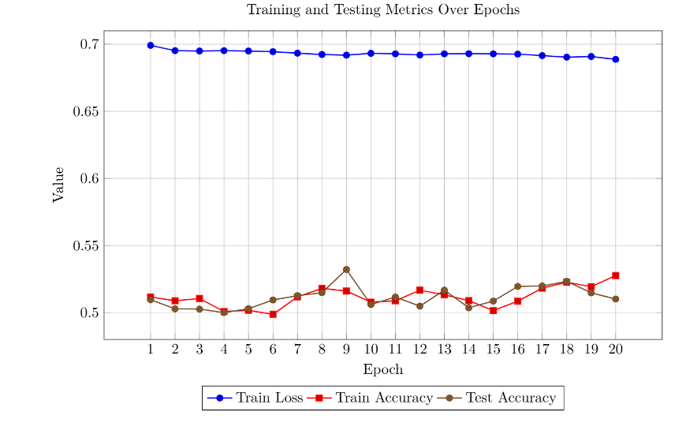
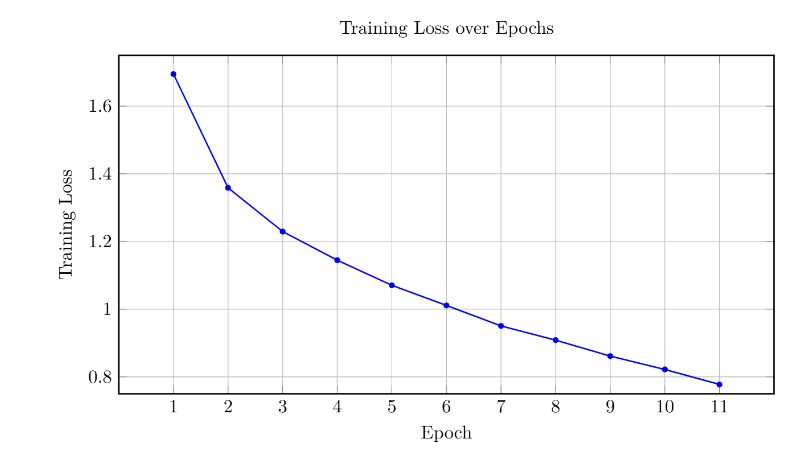
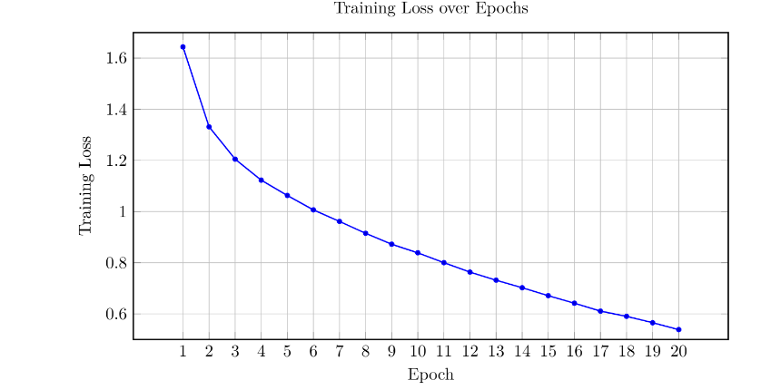

# HW5 — Transformers and Vision Transformers

## Overview

This homework contains two parts:

1. **Transformer Encoder for IMDb Sentiment Analysis**
2. **Vision Transformer (ViT) for CIFAR-10 Image Classification**

The first part applies the Transformer encoder architecture to text classification. The second part adapts the Transformer idea to images by dividing each image into patches and processing them as a sequence.

---

# Part 1 — Transformer for IMDb Sentiment Analysis

## Goal

The goal of this part is to implement a Transformer encoder from scratch and use it for binary sentiment classification on IMDb movie reviews.

Each review is classified as:

| Label | Meaning |
|---|---|
| 0 | Negative review |
| 1 | Positive review |

## Dataset and Preprocessing

The IMDb dataset contains 50,000 movie reviews:

| Split | Number of Reviews |
|---|---:|
| Training set | 25,000 |
| Test set | 25,000 |

The preprocessing steps were:

1. Remove HTML tags.
2. Remove non-alphanumeric characters.
3. Tokenize reviews by splitting text into words.
4. Build a vocabulary using words that appear at least 5 times.
5. Convert reviews into integer sequences.
6. Pad sequences to a fixed length.
7. Load the data using a custom `IMDBDataset` and `DataLoader`.

## Transformer Theory

The Transformer is based on self-attention instead of recurrence or convolution. It allows each token to attend to other tokens in the sequence.

The scaled dot-product attention is:

$$
Attention(Q,K,V)=softmax\left(\frac{QK^T}{\sqrt{d_k}}\right)V
$$

where $Q$, $K$, and $V$ are the query, key, and value matrices.

Since Transformers do not process tokens sequentially like RNNs, positional encoding is added to preserve word order:

$$
PE(pos,2i)=\sin\left(\frac{pos}{10000^{2i/d}}\right)
$$

$$
PE(pos,2i+1)=\cos\left(\frac{pos}{10000^{2i/d}}\right)
$$

## Transformer Architecture

The implemented Transformer classifier contains:

| Component | Value |
|---|---:|
| Embedding dimension | 128 |
| Number of encoder layers | 2 |
| Number of attention heads | 4 |
| Feedforward dimension | 256 |
| Dropout | 0.1 |
| Batch size | 8 |
| Optimizer | Adam |
| Learning rate | 0.001 |
| Loss function | Cross-entropy loss |
| Number of classes | 2 |

The main implemented modules were:

- `PositionalEncoding`
- `MultiheadAttention`
- `TransformerEncoderLayer`
- `TransformerEncoder`
- `TransformerClassifier`
- Training and evaluation loop

The first token representation was used for final classification.

## Transformer Results

The training/testing metric plot shows that the model stayed close to random binary classification performance. The train and test accuracies mostly remained around 50–53%, while the training loss stayed around 0.69.

This suggests that the basic Transformer setup did not learn strong sentiment features in this run.

Possible reasons include:

- simple whitespace tokenization,
- small batch size,
- limited model depth,
- no pretrained embeddings,
- no advanced tokenizer such as WordPiece or BPE,
- using the first token directly instead of a special learned `[CLS]` token.

### Transformer Training and Testing Metrics

  

**Figure 1.** Training and testing metrics for the Transformer sentiment classifier. The accuracy remains close to random binary classification, showing that the model needs stronger preprocessing or tuning.

---

# Part 2 — Vision Transformer for CIFAR-10 Classification

## Goal

The goal of this part is to implement a Vision Transformer from scratch and train it on CIFAR-10 image classification.

CIFAR-10 contains 10 image classes:

| Dataset | Value |
|---|---:|
| Image size | 32×32×3 |
| Training images | 50,000 |
| Test images | 10,000 |
| Number of classes | 10 |

The images were normalized using CIFAR-10 channel statistics:

$$
mean = [0.4914, 0.4822, 0.4465]
$$

$$
std = [0.2470, 0.2435, 0.2616]
$$

## Vision Transformer Theory

A Vision Transformer treats an image as a sequence of patches.

For an image of size $H \times W \times C$ and patch size $P$, the number of patches is:

$$
N=\frac{H \times W}{P^2}
$$

Each patch is flattened and projected into an embedding vector. A `[CLS]` token is added, and positional encoding is used to preserve spatial information.

The Transformer encoder then applies multi-head self-attention to model relationships between image patches.

## ViT Architecture

The implemented ViT uses CIFAR-10 images of size $32 \times 32 \times 3$.

Assuming patch size $P=4$:

$$
N = \left(\frac{32}{4}\right)^2 = 64
$$

So each image becomes 64 patches. After adding the `[CLS]` token, the model processes 65 tokens.

| Component | Value |
|---|---:|
| Image size | 32×32×3 |
| Patch size | 4×4 |
| Number of patches | 64 |
| Tokens after `[CLS]` | 65 |
| Embedding dimension | 128 |
| Encoder layers | 6 |
| Attention heads | 8 |
| Feedforward hidden size | 512 |
| Number of output classes | 10 |
| Batch size | 64 |
| Optimizer | Adam |
| Loss function | Cross-entropy loss |

## ViT Results

The Vision Transformer achieved:

$$
70.50\%
$$

test accuracy on CIFAR-10.

This is a reasonable result for a ViT trained from scratch on a small image dataset. However, it is lower than strong CNN models or pretrained ViTs, because Transformers usually need large datasets or pretraining to perform very well.

The report also notes that using sinusoidal positional embeddings improved the accuracy from about 65% to about 70%.

## ViT Training Loss

The training loss decreased consistently over the epochs, showing that the model was learning.

### ViT Training Loss over 11 Epochs

  

**Figure 2.** ViT training loss over 11 epochs. The loss decreases from about 1.69 to about 0.78.

### ViT Training Loss over 20 Epochs

  

**Figure 3.** ViT training loss over 20 epochs. The loss continues to decrease steadily, reaching around 0.54 by the final epoch.

---

# Hyperparameter Discussion

| Hyperparameter | Effect |
|---|---|
| Patch size | Smaller patches preserve more image detail but increase computation |
| Depth | More encoder layers improve representation power but may overfit |
| Number of heads | More heads allow attention to capture different patch relations |
| Positional encoding | Helps the model understand patch order and spatial structure |
| Pretraining | Usually improves ViT performance significantly |
| Data augmentation | Can improve generalization on small datasets like CIFAR-10 |

For CIFAR-10, patch size 4 is a good balance because the images are small. Larger patches may lose too much local detail.

---

# Overall Results

| Part | Model | Dataset | Main Result |
|---|---|---|---|
| Part 1 | Transformer Encoder | IMDb | Accuracy stayed around 50–53% |
| Part 2 | Vision Transformer | CIFAR-10 | Test accuracy reached 70.50% |
| Part 2 | ViT with sinusoidal position encoding | CIFAR-10 | Accuracy improved from about 65% to about 70% |

---

# Key Takeaways

| Concept | Main Takeaway |
|---|---|
| Transformer | Uses self-attention to model relationships between tokens |
| Positional encoding | Adds order information to token embeddings |
| Multi-head attention | Lets the model attend to different parts of the input |
| IMDb sentiment task | The simple Transformer setup did not learn strong sentiment features |
| Vision Transformer | Treats image patches as a sequence |
| ViT on CIFAR-10 | Achieved 70.50% test accuracy |
| Patch size | Controls the trade-off between detail and computation |
| Pretraining | Important for strong Transformer performance |

---

# Conclusion

This homework implemented two Transformer-based models.

The first part implemented a Transformer encoder for IMDb sentiment analysis. The model included embeddings, sinusoidal positional encoding, multi-head self-attention, feedforward layers, residual connections, layer normalization, and a final classifier. The results stayed near random binary classification accuracy, showing that stronger preprocessing and model tuning are needed for better sentiment classification.

The second part implemented a Vision Transformer for CIFAR-10. The model divided each image into patches, added positional encodings and a `[CLS]` token, and used Transformer encoder layers for classification. The ViT achieved 70.50% test accuracy, and the training loss decreased steadily over the epochs.

Overall, this assignment shows how Transformers can be applied to both text and images, while also showing that good performance depends heavily on preprocessing, positional encoding, dataset size, and hyperparameter tuning.
