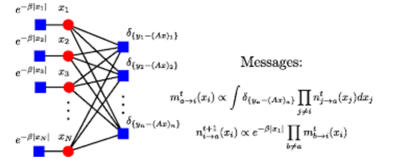
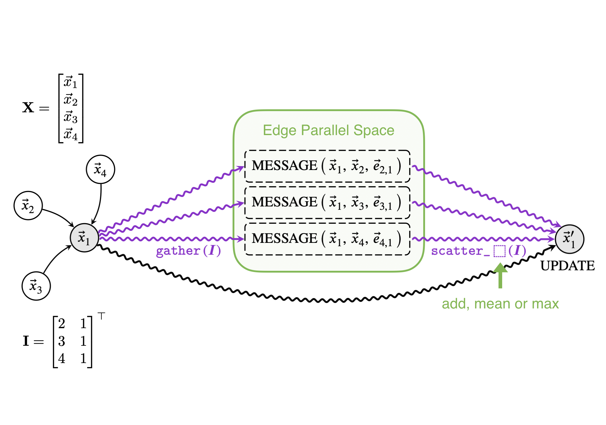
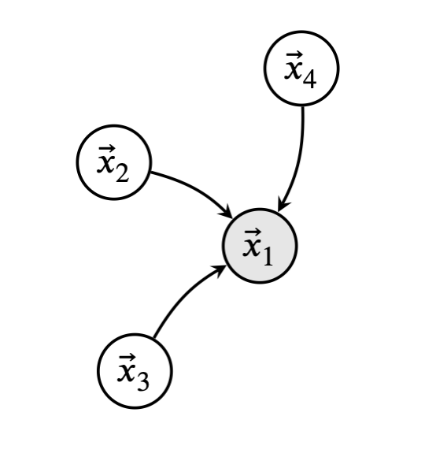
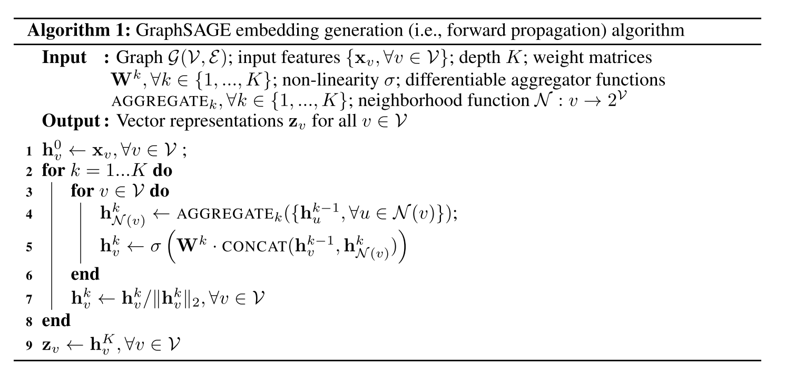

# HW7 — Introduction to Graph Neural Networks

## Overview

This homework studies **Graph Neural Networks (GNNs)** for node classification on graph-structured data. The assignment focuses on the **Cora citation network** and implements two main models:

1. **Graph Convolutional Network (GCN)**
2. **GraphSAGE**

The goal is to understand the message-passing framework, implement GNN layers using PyTorch Geometric, and compare different aggregation methods.

---

## Dataset

The experiments were performed on the **Cora** citation network.

| Property | Value |
|---|---:|
| Dataset | Cora |
| Nodes | 2708 |
| Task | Node classification |
| Classes | 7 |
| Node features | Bag-of-words representation of papers |
| Edges | Citation links between papers |

Each node represents a paper, and each edge represents a citation relation.

---

## Message Passing in GNNs

GNNs update each node representation by collecting information from its neighbors. A general message-passing rule is:

$$
x_i^{(k)} =
\text{UPDATE}
\left(
x_i^{(k-1)},
\text{AGGR}_{j \in \mathcal{N}(i)}
\text{MESSAGE}^{(k)}
\left(
x_i^{(k-1)}, x_j^{(k-1)}, e_{i,j}
\right)
\right),
$$

where:

- $x_i^{(k)}$ is the representation of node $i$ at layer $k$,
- $\mathcal{N}(i)$ is the neighborhood of node $i$,
- `MESSAGE` computes information sent from neighbors,
- `AGGR` combines neighbor messages,
- `UPDATE` produces the new node embedding.

### Factor Graph Message Passing

  

**Figure 1.** A message-passing view where nodes exchange messages through graph connections.

### GNN Gather-Scatter Message Passing

  

**Figure 2.** PyTorch Geometric style message passing: gather neighbor information, compute messages, aggregate them with add/mean/max, and update the target node.

### Simple Graph Example

  

**Figure 3.** A simple graph example where node $x_1$ receives information from neighboring nodes $x_2$, $x_3$, and $x_4$.

---

## GCN Layer

The graph convolutional operator introduced by Kipf and Welling is:

$$
\mathbf{X}^{(k)}=
\hat{\mathbf{D}}^{-1/2}
\hat{\mathbf{A}}
\hat{\mathbf{D}}^{-1/2}
\mathbf{X}^{(k-1)}
\mathbf{\Theta},
$$

where:

- $\hat{\mathbf{A}} = \mathbf{A} + \mathbf{I}$ is the adjacency matrix with self-loops,
- $\hat{\mathbf{D}}$ is the degree matrix of $\hat{\mathbf{A}}$,
- $\mathbf{\Theta}$ is the learnable weight matrix.

Equivalently, for each node:

$$
x_i^{(k)}=
\sum_{j \in \mathcal{N}(i) \cup \{i\}}
\frac{1}{\sqrt{\deg(i)}\sqrt{\deg(j)}}
\left(
x_j^{(k-1)}\mathbf{\Theta}
\right).
$$

The implementation follows these steps:

1. Add self-loops.
2. Apply a linear transformation to node features.
3. Compute degree normalization.
4. Aggregate normalized neighbor features.
5. Return updated node embeddings.

The GCN model uses two graph convolution layers:

| Layer | Description |
|---|---|
| GCNConv 1 | Input features to 16 hidden features |
| ReLU | Non-linearity |
| Dropout | Dropout rate = 0.5 |
| GCNConv 2 | 16 hidden features to 7 classes |
| LogSoftmax | Final class probabilities |

---

## GraphSAGE Layer

GraphSAGE is an inductive GNN model that learns node embeddings by aggregating neighbor features.

The update rule is:

$$
h_i^{(k)}=
\mathbf{W}
\cdot
\left[
h_i^{(k-1)}
\Vert
\text{AGGR}_{j \in \mathcal{N}(i)}
\left(
h_j^{(k-1)}
\right)
\right],
$$

where $\Vert$ denotes concatenation and `AGGR` can be mean, sum, or max.

### GraphSAGE Algorithm

  

**Figure 4.** GraphSAGE embedding generation algorithm. Neighbor embeddings are aggregated and combined with the node’s own representation to generate updated embeddings.

The implemented GraphSAGE model also uses two layers:

| Layer | Description |
|---|---|
| SAGEConv 1 | Input features to 16 hidden features |
| ReLU | Non-linearity |
| Dropout | Dropout rate = 0.5 |
| SAGEConv 2 | 16 hidden features to 7 classes |
| LogSoftmax | Final class probabilities |

Three aggregation methods were compared:

- Mean aggregation
- Sum aggregation
- Max aggregation

---

## Training Setup

Both GCN and GraphSAGE were trained with the same general setup:

| Setting | Value |
|---|---:|
| Optimizer | Adam |
| Learning rate | 0.01 |
| Weight decay | 0.0005 |
| Early stopping patience | 10 epochs |
| Number of runs | 10 |

The models were evaluated using validation loss, test accuracy, and runtime.

---

## Results

| Model | Validation Loss | Test Accuracy | Duration |
|---|---:|---:|---:|
| GCN | 0.7452 | 0.798 ± 0.008 | 6.482 s |
| GraphSAGE Mean | 0.7619 | 0.790 ± 0.015 | 0.905 s |
| GraphSAGE Sum | 1.0896 | 0.738 ± 0.028 | 0.775 s |
| GraphSAGE Max | 0.9350 | 0.762 ± 0.015 | 0.951 s |

---

## Analysis

The **GCN** achieved the highest test accuracy. Degree normalization helps stabilize neighbor aggregation, especially in citation graphs where node degrees can vary.

Among GraphSAGE variants, **mean aggregation** performed best. Mean aggregation balances neighbor contributions, while sum aggregation can overemphasize high-degree nodes and max aggregation may discard useful information.

GraphSAGE was much faster than GCN in this experiment, with all GraphSAGE variants running under one second.

---

## Key Takeaways

| Concept | Main Takeaway |
|---|---|
| GNN | Learns from both node features and graph structure |
| Message passing | Nodes update embeddings using information from neighbors |
| GCN | Uses degree-normalized neighbor aggregation |
| GraphSAGE | Aggregates neighbor features with mean, sum, or max |
| Best accuracy | GCN achieved the best test accuracy |
| Fastest models | GraphSAGE variants were faster than GCN |
| Best GraphSAGE aggregator | Mean aggregation performed best |

---

## Conclusion

This homework introduced Graph Neural Networks through GCN and GraphSAGE implementations on the Cora dataset. The GCN model achieved the best accuracy, while GraphSAGE was faster and showed how different aggregation functions affect performance. Overall, the assignment demonstrates how message passing allows neural networks to use graph structure for node classification.
