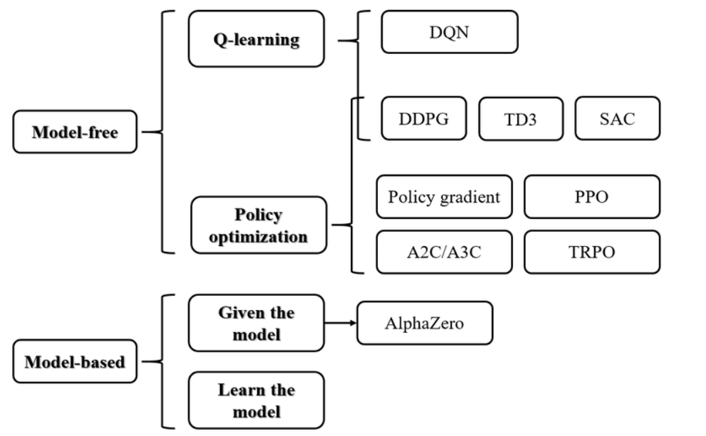
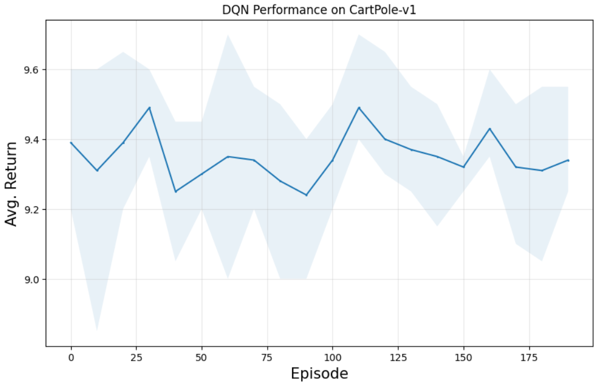
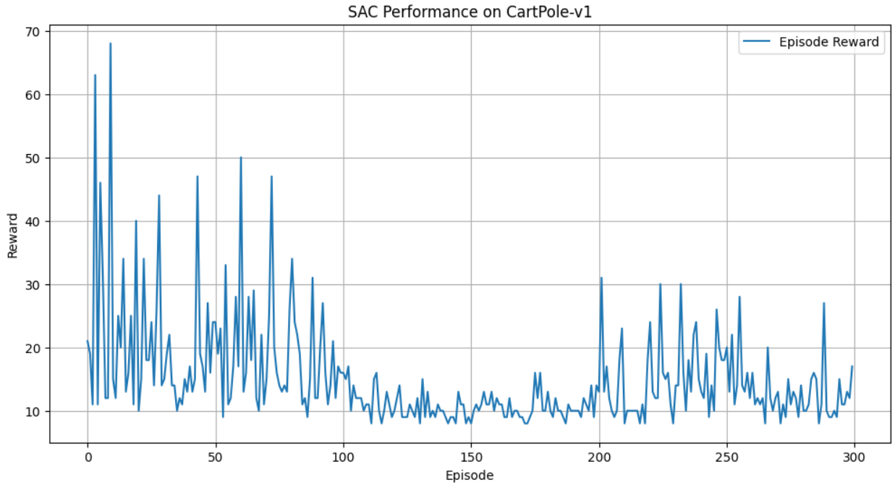
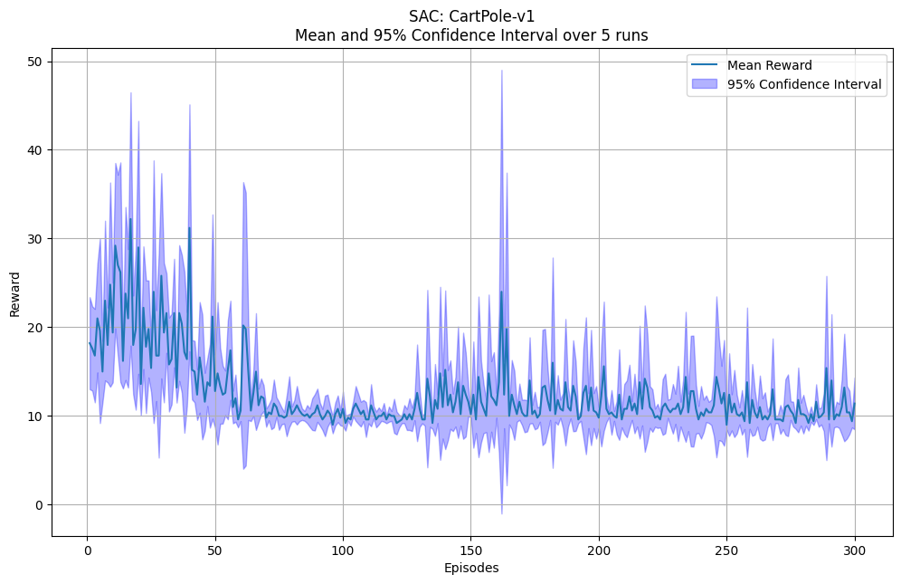
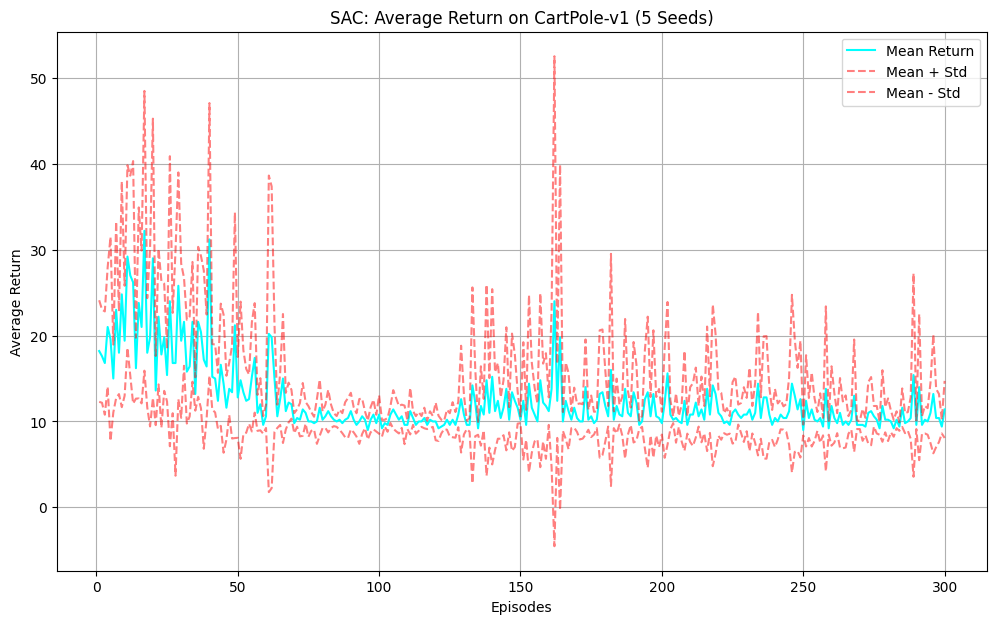

# HW8 — Reinforcement Learning: DQN and SAC on CartPole-v1

## Overview

This homework studies two reinforcement learning algorithms on the `CartPole-v1` environment:

1. **Deep Q-Network (DQN)**
2. **Soft Actor-Critic (SAC)**

The first part implements a value-based method, DQN, using a Q-network, replay buffer, target network, and epsilon-greedy exploration.  
The second part implements SAC, an off-policy actor-critic method based on maximum-entropy reinforcement learning.

---

## Reinforcement Learning Categories

  

**Figure 1.** Reinforcement learning methods can be divided into model-free and model-based methods. DQN belongs to value-based model-free learning, while SAC is an actor-critic method under policy optimization.

---

# Part 1 — DQN

## DQN Idea

DQN is a value-based reinforcement learning algorithm. It learns an action-value function:

$$
Q(s,a)
$$

which estimates the expected return after taking action $a$ in state $s$.

The agent selects actions using:

$$
a = \arg\max_a Q(s,a)
$$

during exploitation, and random actions during exploration.

---

## DQN Components

The implementation contains:

| Component | Role |
|---|---|
| `FCModel` | Fully connected neural network for estimating Q-values |
| `QNetwork` | Wraps the Q-network and optimizer |
| `ReplayMemory` | Stores past transitions for experience replay |
| `Policy` | Implements epsilon-greedy action selection |
| `DQNAgent` | Handles training, testing, replay buffer filling, and optimization |

The Q-network architecture is:

| Layer | Description |
|---|---|
| Input | CartPole state with 4 features |
| FC1 | 128 hidden units + ReLU |
| FC2 | 128 hidden units + ReLU |
| Output | 2 Q-values, one for each action |

---

## Replay Buffer

The replay buffer stores transitions of the form:

$$
(s, a, s', r)
$$

It is important because it:

- breaks correlation between consecutive samples,
- improves sample efficiency by reusing old transitions,
- stabilizes DQN training,
- enables off-policy learning.

A burn-in phase was used to fill the replay buffer with random experience before training.

---

## Epsilon-Greedy Policy

The DQN policy uses epsilon-greedy exploration.

| Parameter | Value |
|---|---:|
| Initial epsilon | 1.0 |
| Final epsilon | 0.05 |
| Epsilon decay | 0.995 |

At the beginning, the agent explores mostly randomly. As training progresses, epsilon decreases and the agent relies more on the learned Q-network.

---

## DQN Training Setup

| Setting | Value |
|---|---:|
| Environment | CartPole-v1 |
| Training episodes | 200 |
| Test episodes | 20 |
| Number of seeds | 5 |
| Learning rate | 5e-4 |
| Discount factor | 0.99 |
| Batch size | 128 |
| Replay memory size | 50,000 |
| Burn-in steps | 10,000 |
| Target update interval | 10 |

---

## DQN Result

  

**Figure 2.** DQN performance on CartPole-v1 over 5 seeds. The average return stayed around 9–10, showing that the implemented DQN did not solve the environment in this run.

The DQN results show that the model was implemented correctly, but the training performance was weak. Possible reasons include limited tuning, unstable updates, or insufficient training.

---

# Part 2 — SAC

## SAC Idea

Soft Actor-Critic is an off-policy actor-critic algorithm. Unlike DQN, SAC learns a stochastic policy and maximizes both reward and entropy.

The SAC objective is:

$$
J(\pi) =
\mathbb{E}
\left[
\sum_t r_t + \alpha H(\pi(\cdot|s_t))
\right],
$$

where:

- $r_t$ is the reward,
- $H(\pi)$ is the entropy of the policy,
- $\alpha$ controls the reward-exploration tradeoff.

Entropy encourages the policy to stay stochastic, which improves exploration.

---

## SAC Components

The SAC implementation contains:

| Component | Role |
|---|---|
| Policy network | Outputs action probabilities using softmax |
| Two Q-networks | Estimate soft Q-values and reduce overestimation bias |
| Value network | Estimates soft state value |
| Target networks | Improve training stability |
| Replay buffer | Stores past transitions |
| Entropy tuning | Automatically adjusts exploration coefficient $\alpha$ |

Since CartPole-v1 has a discrete action space, the policy uses a `Categorical` distribution over two actions.

---

## SAC Training Setup

| Setting | Value |
|---|---:|
| Environment | CartPole-v1 |
| Episodes | 300 |
| Number of runs | 5 |
| Discount factor $\gamma$ | 0.99 |
| Soft update rate $\tau$ | 0.005 |
| Learning rate | 3e-4 |
| Hidden size | 256 |
| Replay buffer size | 1,000,000 |
| Batch size | 256 |
| Automatic entropy tuning | True |

---

## SAC Single-Run Result

  

**Figure 3.** SAC performance on CartPole-v1 for a single run. The reward has large early spikes but later stabilizes around lower values.

The single-run SAC output showed large reward fluctuations. Some early episodes reached high rewards, but the later training did not remain consistently high.

---

## SAC Average Return over 5 Seeds

  

**Figure 4.** SAC average return over 5 seeds with mean plus/minus standard deviation. The curve shows high variance, especially in the early episodes.

---

## SAC Mean and 95% Confidence Interval

  

**Figure 5.** SAC mean reward with 95% confidence interval over 5 runs. The confidence interval is wide in several regions, showing instability across seeds.

---

## SAC vs DQN

| Aspect | DQN | SAC |
|---|---|---|
| Type | Value-based | Actor-critic |
| Policy | Epsilon-greedy | Stochastic |
| Exploration | Random actions using epsilon | Entropy maximization |
| Main network | Q-network | Actor, Q-networks, value network |
| Target update | Hard update | Soft update |
| Action space | Discrete | Usually continuous, adapted here to discrete |
| Complexity | Simpler | More complex |

DQN learns what action has the highest value, while SAC directly learns a stochastic policy and value estimates at the same time.

---

## Key Takeaways

| Concept | Main Takeaway |
|---|---|
| DQN | Learns Q-values and selects actions using epsilon-greedy exploration |
| Replay buffer | Stabilizes training by sampling past transitions |
| Target network | Helps reduce instability in Q-learning |
| SAC | Maximizes both reward and entropy |
| Actor-critic | Uses both policy and value networks |
| Entropy | Encourages exploration and avoids early deterministic behavior |
| CartPole result | Both implementations showed unstable or weak learning in this run |

---

## Figure Files

Save the figures in the `figures` folder using these names:

| Figure | File Name |
|---|---|
| SAC average return with mean and std | `figures/sac_average_return_mean_std.png` |
| RL algorithm taxonomy | `figures/rl_algorithm_taxonomy.png` |
| DQN performance on CartPole-v1 | `figures/dqn_cartpole_performance.png` |
| SAC mean reward with 95% confidence interval | `figures/sac_mean_ci_5_runs.png` |
| SAC single-run performance | `figures/sac_cartpole_single_run_performance.png` |

---

## Conclusion

This homework implemented and compared DQN and SAC on CartPole-v1. DQN was implemented as a value-based model-free method using a Q-network, replay buffer, target network, and epsilon-greedy exploration. SAC was implemented as an off-policy actor-critic algorithm with entropy regularization, stochastic policy learning, Q-networks, value networks, and replay buffer training.

The results showed that both methods ran successfully, but the achieved returns were not stable enough to solve CartPole-v1 in these runs. DQN stayed around low average returns, while SAC showed high variance and occasional reward spikes. This highlights that reinforcement learning algorithms are sensitive to hyperparameters, implementation details, exploration strategy, and training stability.